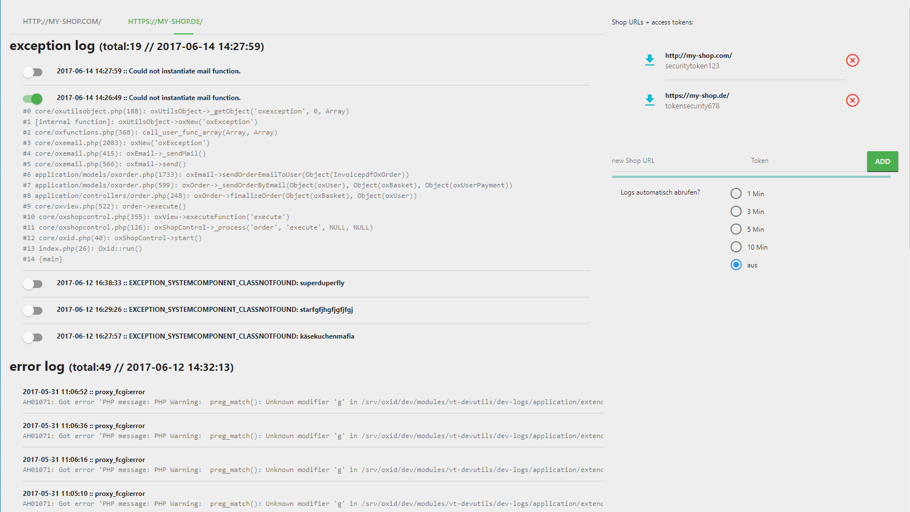

# OXID-log-assistant
Fetch and view logs from your oxid eshops, also get notification on new exceptions

(credits to [@Crease29](https://github.com/Crease29) for plugin name)

# installation
* download and install vt-devutils: https://github.com/vanilla-thunder/vt-devutils
* activate at least dev-logs module
* copy access token from module description 
* install this chrome extension from chromw web store
* click on extension icon to open extension options
* enter shop url (like http://my-shop.de/ ) and token

## functions
- view last 10 exceptions and 20 webserver errors for multple shops
- automatically fetch logs every 1 / 3 / 5 / 10 minutes
- get notification on new exception or error

