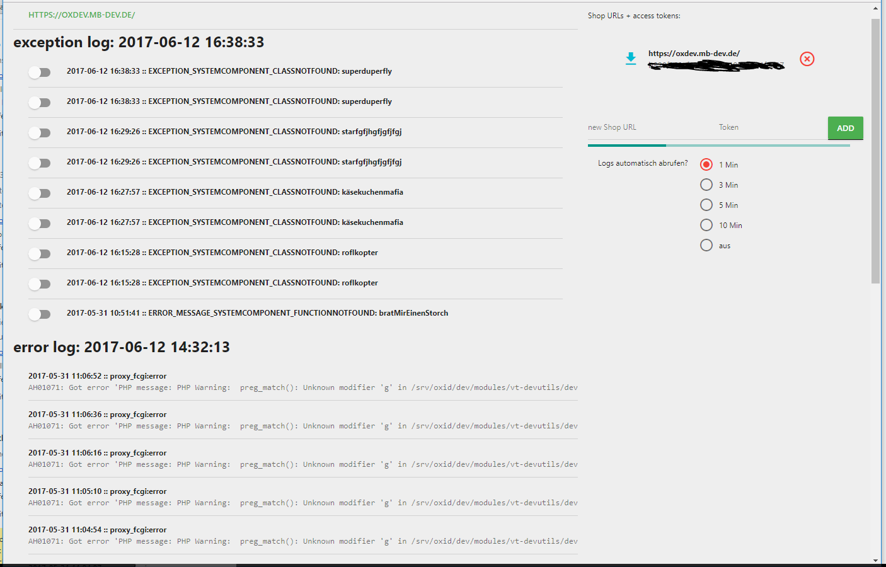

# OXID-log-assistant
Fetch and view logs from your oxid eshops, also get notification on new exceptions

(credits to Kai N. for plugin name)

## functions
- view last 10 exceptions and 20 webserver errors for multple shops
- automatically fetch logs every 1 / 3 / 5 / 10 minutes
- get notification on new exception or error

